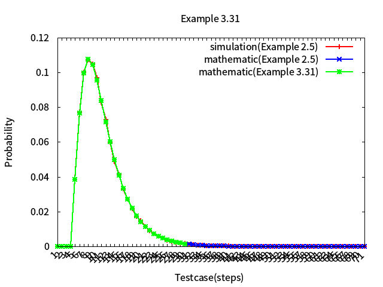

# Stochastic Calculus
Record the learning materials of the course - "stochastic calculus" in National Cheng Kung University.

> **Before starting to read this article, please install chrome extension: [`Github with MathJax`](https://chrome.google.com/webstore/detail/github-with-mathjax/ioemnmodlmafdkllaclgeombjnmnbima/related), to ensure the correctness of formula format.**

- [stochastic-calculus-and-probability-model](#stochastic-calculus-and-probability-model)
    - [Practice Cases](#practice-cases)
        - [Example 2.5](#example-25)
        - [Example 3.31](#example-331)
        - [Poisson Distribution](#poisson-distribution)
- [Author](#author)

Mostly use **`C++`** to do both simulation/mathematic work and validation.

## Practice Cases

### [Example 2.5](example2.5/)

### [Example 3.31](example3.31/)

### [Poisson Distribution](poisson_distribution/)

* Merge 

* Split

# Author 

* Kevin Cyu(瞿旭民), kevinbird61@gmail.com