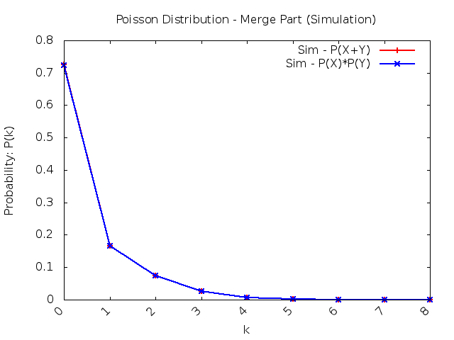
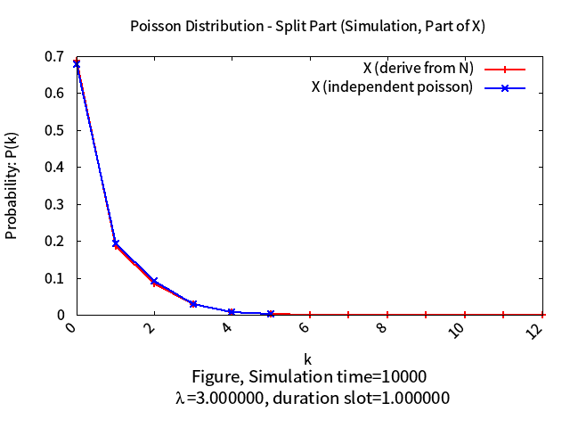
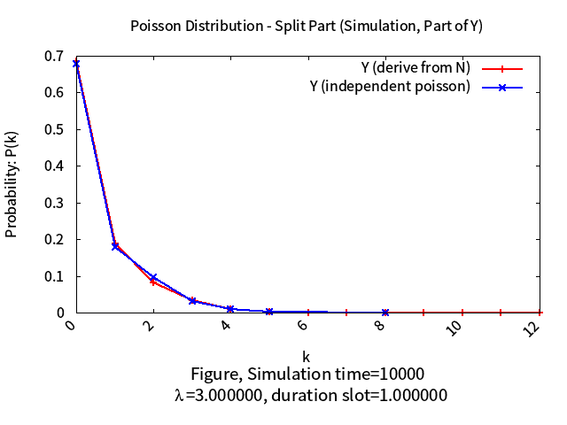

# Stochastic Calculus
Record the learning materials of the course - "stochastic calculus" in National Cheng Kung University.

> **Before starting to read this article, please install chrome extension: [`Github with MathJax`](https://chrome.google.com/webstore/detail/github-with-mathjax/ioemnmodlmafdkllaclgeombjnmnbima/related), to ensure the correctness of formula format.**

- [Stochastic Calculus](#stochastic-calculus)
    - [Practice Cases](#practice-cases)
        - [Example 2.5](#example-25)
        - [Example 3.31](#example-331)
        - [Poisson Distribution](#poisson-distribution)
        - [Random Access Problem in Machine-to-Machine](#random-access-problem-in-machine-to-machine)
- [Author](#author)

Mostly use **`C++`** to do both simulation/mathematic work and validation.

## Practice Cases

### [Example 2.5](example2.5/)

---

### [Example 3.31](example3.31/)

---

### [Poisson Distribution](poisson_distribution/)

| | Merge Poisson Process | Split Poisson Process | 
| ------ | ------ | ------ |
| Mathematic |  |  |
| Simulation |  |   |

---

### [Random Access Problem in Machine-to-Machine](m2m/)

| Access Class Barring | Random Access |
| ------ | ------ |
|  |  | 

---

# Author 

* Kevin Cyu(瞿旭民), kevinbird61@gmail.com