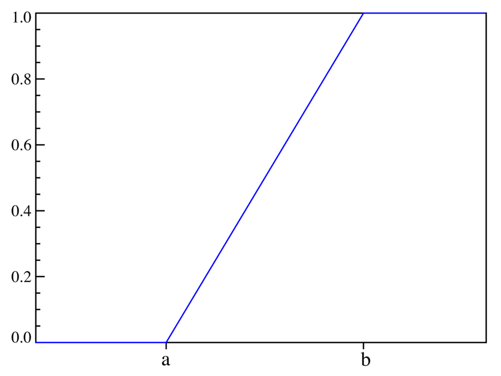
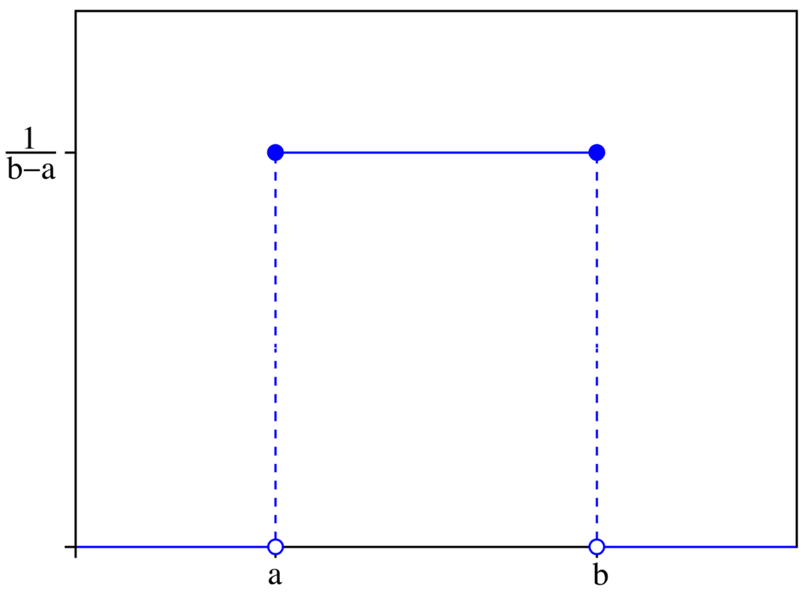
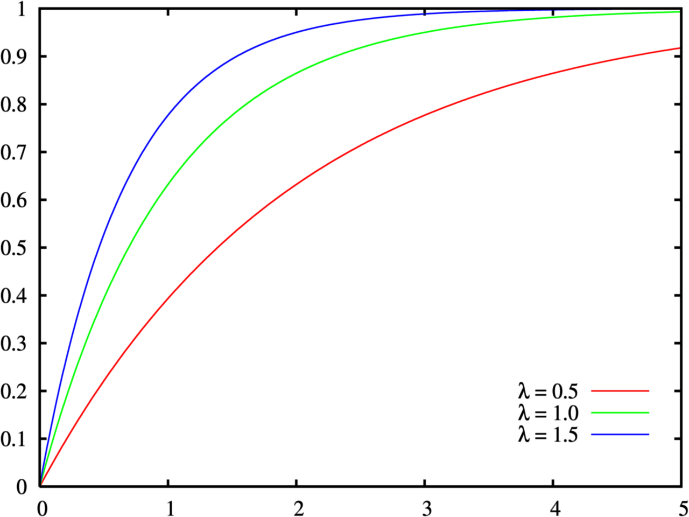
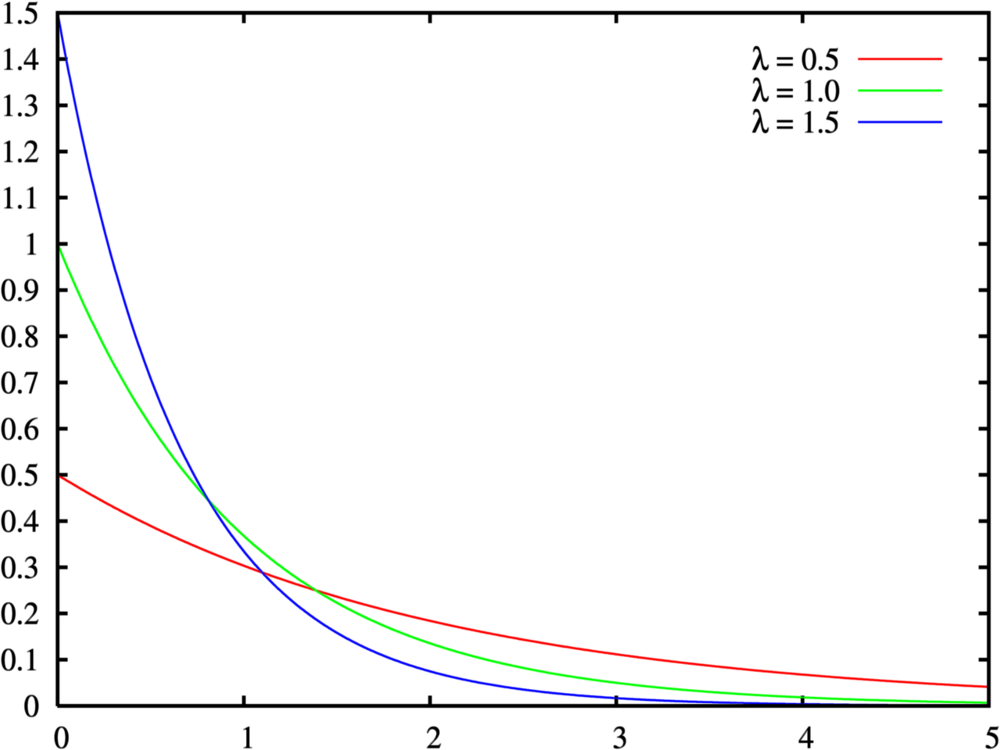
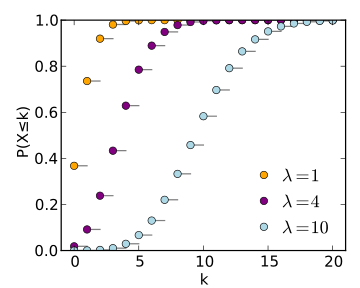
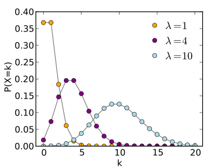

# Meaning of Probability distribution

Investigate the meaning of each probability distribution.

## Uniform distribution

連續型均勻分佈

* CDF

* PDF

* 表示該機率為均勻分佈，不管目前的 x 值為多少，身為 y 軸的機率都一樣
* 所產生的的 cdf 為 y=kx 的直線（穩定累加）

## Exponential distribution

指數分佈

* CDF

* PDF

* 為一指數分佈圖形，表達意義為: 可以用來表示 `"獨立隨機事件發生的時間間隔"`，比如旅客進入機場的時間間隔、打進客服中心電話的時間間隔、中文維基百科新條目出現的時間間隔等等。

## Poisson distribution

* CDF

* PDF

* 為一 "離散機率分佈"
* 適合描述 `"單位時間內，一個隨機事件的次數的機率分佈"`，像是：
    * 某一服務設施在 `"一段時間內"` 受到的服務請求的次數
    * 電話交換機接到呼叫的次數
    * 候車站的候客人數
    * 自然災害的發生次數

* 包含 "隨機事件"，以及其發生的分佈（可從 timeline 上獲得分佈！）
    * 所以在我們實作 Poisson 機率分佈時，可以套用 `exponential random variable` 作為來源（表達隨機事件上，任意一種事件的發生機率） 