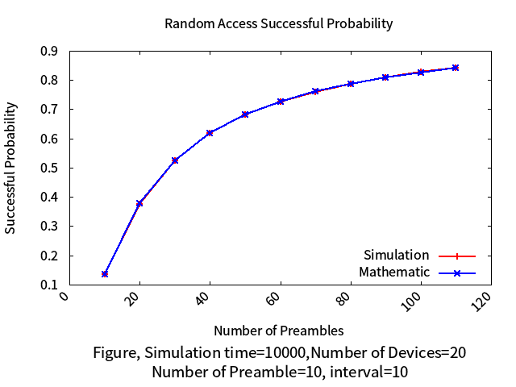

# Random Access Problem in Machine-to-Machine

> * Source Code: https://goo.gl/9zUwYw
> * **Before starting to read this article, please install chrome extension: [`Github with MathJax`](https://chrome.google.com/webstore/detail/github-with-mathjax/ioemnmodlmafdkllaclgeombjnmnbima/related), to ensure the correctness of formula format.**
> * Other requirements: `gnuplot`, `astyle`

<!-- TOC -->

- [Random Access Problem in Machine-to-Machine](#random-access-problem-in-machine-to-machine)
    - [Talking About Network Modeling](#talking-about-network-modeling)
    - [Our Environment: `LTE-A cellular network`](#our-environment-lte-a-cellular-network)
    - [Part A: Access Class Barring](#part-a-access-class-barring)
        - [Technique Background](#technique-background)
        - [System Model](#system-model)
        - [Simulation](#simulation)
        - [Analysis](#analysis)
    - [Part B: Random Access](#part-b-random-access)
        - [Technique Background](#technique-background)
        - [System Model](#system-model)
        - [Simulation](#simulation)
        - [Analysis](#analysis)
    - [Reference](#reference)

<!-- /TOC -->
## Talking About Network Modeling

A basic way to build network model:
1. Technique background (From `paper` ,technical essay, magazine ... etc)
2. System model (Mathematic & Question-Defined)
3. Simulation (Base on Step 1,2 to construct `program`)
4. Analysis (Measure the result from program)

Base on this four method, we can easily define our question and find an efficient way to locate and find the answer.

## Our Environment: `LTE-A cellular network`

* LTE-A cellular network [ [1] ](#reference)

* Access class barring procedure for an MTC device or UE [ [1] ](#reference)

---
## Part A: Access Class Barring

### Technique Background

* Here we can refer the **Fig 2.** to see the `Access Class Barring` part.
* We need to create a `simulation` and `mathematic` model to represent this part.
* Assumption was made:
    * Draw a random number q~uniform(0, 1) before performing the random access procedure.
    * Assume that devices are blocked for 1 ms. 
    * Calculate the `access delay` by simulation and mathematical analysis.

### System Model 

Here we construct our mathematic model from technique background:

* Before calculate access delay, consider:
    * How many times do we need to complete this job? (All devices pass the access class barring)
    * Find the worst case as upperbound.
    * Then we can summation the result from best case to worse case.

* Our upperbound is generated after running the simulation model( will mention later ), we use the worse case in simulation process as our worse case in mathematic model, so that the result can plot together in well organization.

### Simulation 

In simulation part, I choose `probability "p"(threshold)` as observed value; Adjust this value to see the variation among different `p` value.

In each `p` case, we run `s` times of simulation routine. Each routine will finish when all devices have passed the access class barring; and each routine will record its delay times at the end of routine. 

After running `s` simulation routines, we can get an average access delay! We take this value as **access delay** of simulation. 

### Analysis 

Run with command `make test_a` to generate the test data of `Part A`.(`make test` will run all the testcase, include A and B.)

| case | simulation times  | $$Number\ of\ device$$ | $$P$$ | result |
| ------------- | ------------- | ------------- | ------------- | ------------- |
| 1 | 100 | 30 | 0.1~0.9 |  |
| 2 | 100 | 40 | 0.1~0.9 |  |
| 3 | 10000 | 20 | 0.1~0.9 |  |
| 4 | 100000 | 20 | 0.1~0.9 |  |

As the result shown above, we can see curves of **simulation** and **mathematic** are matching with each other.

---
## Part B: Random Access

### Technique Background

* Here we can refer the **Fig 2.** to see the `Random Access` part.
* We need to create a `simulation` and `mathematic` model to represent this part.
* Assumption was made:
    * Simulate a contention-based random access procedure. 
    * Collision occurs when devices are trying to transmit the same preamble.
    * There is no retransmission in your simulation.
    * Compute the success probability after the random access procedure by simulation and mathematical analysis.

### System Model 

Assume there have `M` devices (e.g. `UE` / `MTC device`), and `N` preamble.

We can find the successful nodes from this paper. [ [2] ](#reference)

$$u(n)=n (1-\frac{1}{p})^{n-1}$$

$$\ n=number\ of \ devices,\ p=number\ of\ preamble$$

And we can easily calculate the successful probability: 

$$success\ probability = (1-\frac{1}{p})^{n-1}$$

We take this as our mathematic model.

### Simulation 

In simulation part, I choose `number of preamble` as observed value; Adjust this value to see the variation among different `preamble` value with specified `interval` to iterate, and in each `preamble` case, we run `s` times of simulation routine.

Consider that we don't need to care about **"retransimisson"**, so in each simulation routine, we only need to calculate the success devices(which using unique preamble).

And at the end of routine, using success devices to calculate **successful probability**.

### Analysis 

Run with command `make test_b` to generate the test data of `Part B`.(`make test` will run all the testcase, include A and B.)

| case | simulation times  | $$Number\ of\ device$$ | $$Preamble\ range$$ | result |
| ------------- | ------------- | ------------- | ------------- | ------------- |
| 1 | 10000 | 20 | 1 ~ 20 |  |
| 2 | 10000 | 20 | 10 ~ 100 |  |
| 3 | 100000 | 20 | 10 ~ 100 |  |

As the result shown above, we can see curves of **simulation** and **mathematic** are matching with each other.

---
## Reference

[[1] Efficient cooperative access class barring with load balancing and traffic adaptive radio resource management for M2M communications over LTE-A](). **Yi-Huai Hsu, Kuochen Wang, Yu-Chee Tseng**. *Department of Computer Science, National Chiao Tung University, Hsinchu 300, Taiwan*

[[2] Lower Bounds on the LTE-A Average Random Access Delay Under Massive M2M Arrivals](https://web.cs.hacettepe.edu.tr/~mkoseoglu/koseoglu_tcom2.pdf). **Mehmet Koseoglu**. *IEEE, member*