# Poisson Probability Discussion

> Source Code: https://github.com/kevinbird61/stochastic-calculus-and-probability-model/tree/master/poisson_distribution
> 
> **Before starting to read this article, please install chrome extension: [`Github with MathJax`](https://chrome.google.com/webstore/detail/github-with-mathjax/ioemnmodlmafdkllaclgeombjnmnbima/related), to ensure the correctness of formula format.**

<!-- TOC -->

- [Poisson Probability Discussion](#poisson-probability-discussion)
    - [Improvement](#improvement)
    - [Discuss two *network model*](#discuss-two-network-model)
        - [Example 2.37 (Merge)](#example-237-merge)
            - [Mathematic Model](#mathematic-model)
            - [Simulation Model](#simulation-model)
                - [Implementation Detail](#implementation-detail)
            - [Result](#result)
            - [Different Case](#different-case)
        - [Example 3.23 (Split)](#example-323-split)
            - [Mathematic Model](#mathematic-model)
            - [Simulation Model](#simulation-model)
            - [Result](#result)
            - [Different Case](#different-case)
    - [Reference](#reference)
    - [Author](#author)

<!-- /TOC -->

## Improvement 

After `example 2.5`, `3.31`, the program has been refactor a lot, make code reusable.

* Consider simulation need to be tested with several different input, to **accelerate** the arguments parsing process, I construct `parse_arg` class to deal with this problem. [See more about `parse_arg`.](../utils/README.md#parse_arg)

## Discuss two *network model*

### Example 2.37 (Merge)
* It will be implemented in `part_a.cc`
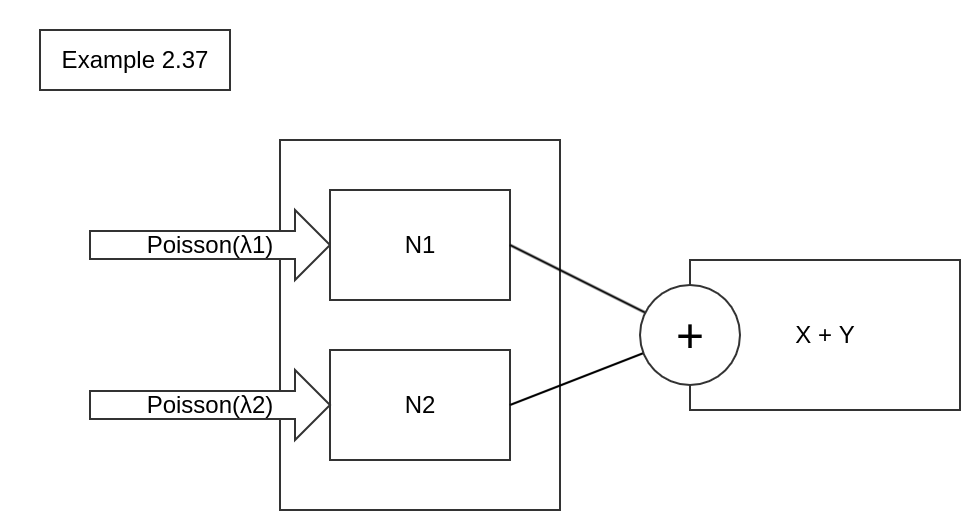

--- 

#### Mathematic Model

* Because N1,N2 is **independent**, so we know N1=> $$N_1 | N=n \sim Binomial(n,p)$$, which N2: $$N_2 | N=n \sim Binomial(n,1-p)$$ , Both N1,N2 is a sum of `n` independent *Bernoulli(p)* random variables, with `Binomial(N,P)`, N and P represent **Number and Probability**.

* We have: 

$\begin{array}{lcl}
P_{N_1}(k)&=& \sum_{n=0}^\infty P(N_1=k | N=n)\cdot P_{N1}(n) \\
& & \\
& = &\sum_{n=k}^\infty C_k^n \cdot p^k (1-p)^{n-k} \cdot e^{-\lambda} \frac{\lambda^n}{n!} \\
& & \\
& = &\sum_{n=k}^\infty \frac{p^k(1-p)^{n-k}\lambda^n}{k!(n-k)!}
& & \\
& = & \frac{e^{-\lambda}\cdot (\lambda p)^k}{k!} \sum_{n=k}^\infty \frac{(\lambda (1-p)^{n-k})}{(n-k)!} \\
& & \\
& = & \frac{e^{-\lambda}\cdot (\lambda p)^k}{k!}  \cdot e^{\lambda(1-p)}\\
& & \\
& = & \frac{e^{-\lambda p}\cdot (\lambda p)^k}{k!} \ , for \ k = 0,1,2, ...\\
\end{array}$

* So that we conclude that

$\begin{aligned}
& N_1 \sim Poisson(\lambda\cdot p) \\
& N_2 \sim Poisson(\lambda\cdot (1-p)) \\ 
\ \\
& which\ N_1\ and\ N_2\ are\ independent,\ \\
& so\ P_{N_1+N_2}\ will\ be\ :\\
& P_{N_1+N_2}(n,m) = P_{N_1}(n) \cdot P_{N_2}(m) \\
\end{aligned}$

* Consider the formula: $$P(X+Y=n)=\sum_{k=0}^nP(X=k, Y=n-k)   $$

$$ = \sum_{k=0}^nP(X=k) \cdot P(Y=n-k)$$

So that `Merging Poisson Process` can be:

* **Directly** calculate the *S=X+Y* with: $$P(X+Y=n)=\frac{e^{-(\lambda_1+\lambda_2)}}{n!} \cdot (\lambda_1 + \lambda_2)^n$$

* **Separately** calculate *X* and *Y* with: 

$\begin{array}{lcl}
P(X=k) &=&\frac{e^{-(\lambda_1)}}{n!} \cdot (\lambda_1)^n, \\
& & \\
P(Y=n-k) &=&\frac{e^{-(\lambda_2)}}{(n-k)!} \cdot (\lambda_2)^{n-k}
\end{array}$
, and need to consider the summation, from **k=0~n**: $$\sum_{k=0}^n ...$$

--- 

#### Simulation Model

* We can use exponential distribution: $$f(x)=\lambda \cdot e^{-\lambda\cdot x}$$, which let `x` be a random number to get a **random variable** from exponential distribution.

* In my implementation, I use C++ STL (`standard library`) - `<random>` to do this.

##### Implementation Detail 

* **`Step 1`**, I using self-defined class - `event_list` as my event queue. See more about [`event_list.`](../utils/event_list.h)

* **`Step 2`**, scheduling 2 individual event: `X`, `Y` into event queue for initialization, then we can start our simulation. End condition is the number you can set in arguments before starting program by `-s`.

* **`Step 3`**, pop out the element from `event_list`, and depend on its type (e.g. is `X` or `Y`?) to schedule next event with **exponential random variable** as timestamp and push back into `event_list`. And the old event will be record into this `event_list` object (treat like a event history, sort by its timestamp.). *Do this routine until reaching the number we set by specifying `-s`.*

* **`Step 4`**, after event scheduling process has been done, we now can count the ratio of event arrival in each time scale.
    * For example, between timestamp `0.0~1.0`, we get `5` event arrival during this time scale; And `1.0~2.0`, we get `4` as event arrival.
    * Now, assume `2.0` is the end point of simulation, we now have 2 result: `X=5` and `X=4`, both have 1 occurance.
    * Then we can say: P(X=5)=1/(1+1)=`0.5`=`50%`=P(X=4) !

* **`Step 5`**, and now we have the history record in object of `event_list`, which record the type of each event, then we can pop it out and get the `P(X)`, `P(Y)` and `P(X+Y)`, with specified value of time scale: $$time\ scale = e(-1/(\lambda_1+\lambda_2))$$, which $$rate\ parameter = \lambda\ , scale\ parameter = \ 1/\lambda = \beta $$

* **`Final`**, Then we can count the arrival rate in this time scale to finish our simulation!

#### Result

* So we need to compare `simulation` and `mathematic` model:
    * run with command `make && make plot` to run the program and plot: $$k=20,\ \lambda_X=1,\ \lambda_Y=2$$, also if you want to adjust, please using `./part_a.out -h` to see more.
    * **Mathematic Model**
        
        

    * **Simulation Model**
        
        

* We can see, both `mathematic` and `simulation` model all have the same curve in **`P(X+Y)`** and **`P(X)*P(Y)`**

#### Different Case

* After we have finished the `part_a.cc` and compile it to get the executable file, we now can use it to run **`multiple testcase`** - [***test_a.sh***](test_a.sh)

| case | simulation times  | $$\lambda_1$$ | $$\lambda_2$$ | result |
| ------------- | ------------- | ------------- | ------------- | ------------- |
| 1 | 10000  | 1  | 2 | 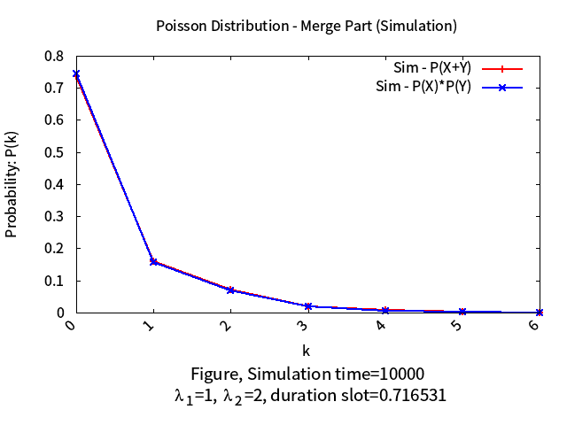 |
| 2 | 10000  | 1  | 5 | 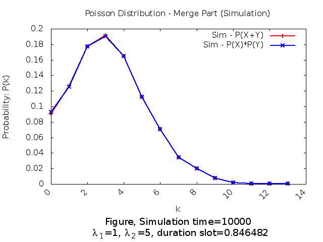 |
| 3 | 10000 | 1 | 10 | 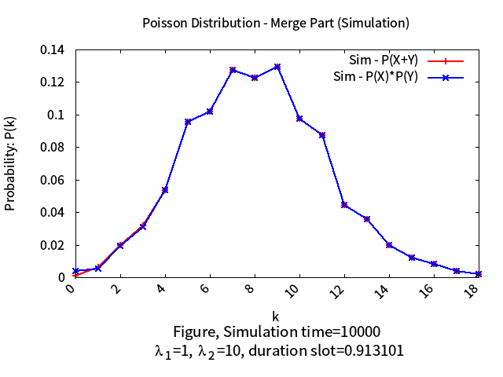 |
| 4 | 10000 | 10 | 20 | 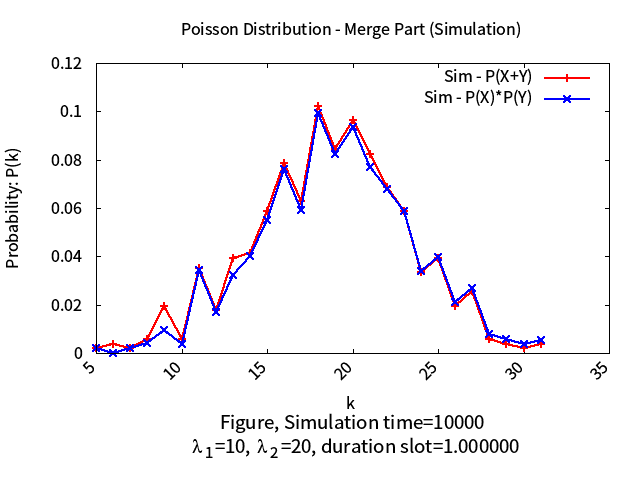 |
| 5 | 100000 | 10 | 20 | 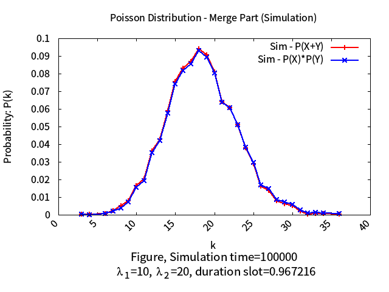 |

* Parameters:
    * `simulation times` represent the **number** of total event in simulation process.
    * `lambda_1` represent the lambda in `X`.
    * `lambda_2` represent the lambda in `Y`.

* As the result shown above, we can see `P(S=X+Y)` is almost perfectly match with `P(X)*P(Y)`; And we can see in case 4, these 2 curves are quite not matching with each other; But after increase the total event number, then we can see these 2 curves are matching again.

--- 

### Example 3.23 (Split)
* It will be implemented in `part_b.cc`

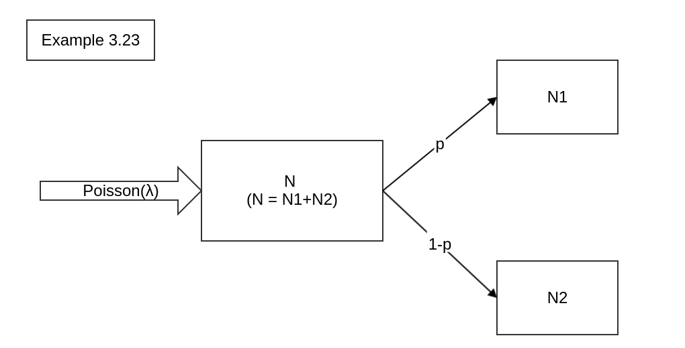

In this part, we can see Part-B is the inverse process of Part-A (e.g. `Poisson Process Merge`). Part-B is the `Poisson Process Split`, which separate one arrival queue into 2 different set of queue, with specified `probability`(p) to transform from original one to these 2 different set.

--- 

#### Mathematic Model

From the formula, we can have the equation: $$P(X+Y)=P(\lambda \cdot p_x) \cdot P(\lambda \cdot (1-p_x))$$, which $$P(X) = P(\lambda \cdot p_x),\ P(Y)=P(\lambda \cdot (1-p_x))$$

So in mathematic part, we can construct this equation by program. See detail in [part_b.cc](part_b.cc).

--- 
#### Simulation Model

As the same concept in Part-A, we use a event queue to represent the entire simulation.

The **differences** between them are:
* `lambda_1` and `lambda_2` become `lambda * p` and `lambda * (1-p)`
* When each arrival event occur, we need to using a random number ( `0.0`~`1.0` ) to decide this event type (e.g. become "`X`" or "`Y`"), and as same as `Step 3` in `Part-A`, assign an exponential random variable as timestamp to this event, and then schedule it into event list.
* And we can use the same step of `Step 4` in `Part-A`, to get the probability of each number of event occur during specified time scale: $$e^{-1.0/\lambda}$$
* **Most important part,** in `Part B` there have need to create three event queue, `N`, `LX`, `LY` respectively.
    * `N = N ~ Poisson (λ)`, is using to generate the `X (derive from N)` and `Y (derive from N)` with probability `p` and `1-p`
    * `LX` represent the independent Poisson (λ*p), compare with `X (derive from N)`.
    * `LY` represent the independent Poisson (λ*(1-p)), compare with `Y (derive from N)`.
    * The other calculation are similar with above.
* With all the statistics required, we can count the arrival rate in this time scale to finish our simulation!

---
#### Result

* Run `make && make plot` with statistics: $$k=20,\ \lambda=3,\ p=0.5$$, also if you want to adjust, please using `./part_b.out -h` to see more.

* **Mathematic Model**

    

* **Simulation Model** (with `10000` event)
    * `X (derive from N)` compare with `LX (Poisson (λ*p))`

        

    * `Y (derive from N)` compare with `LY (Poisson (λ*(1-p)))`

        

    * Also, you can compare `P(X+Y)` with `P(X)*P(Y)`, too

        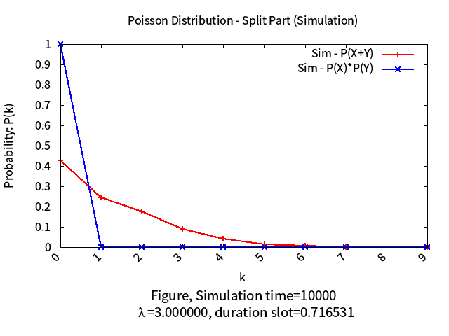

And next part we will adjust the parameter and compare the results.

#### Different Case

* After we have finished the `part_b.cc` and compile it to get the executable file, we now can use it to run **`multiple testcase`** - [***test_b.sh***](test_b.sh)

| simulation times  | $$\lambda$$ | $$P$$ | `X , LX` | `Y, LY` |
|  ------------- | ------------- | ------------- | ------------- | ------------- |
| 10000 | 3 | 0.5 |  |  |
| 10000 | 6 | 0.3 |  | 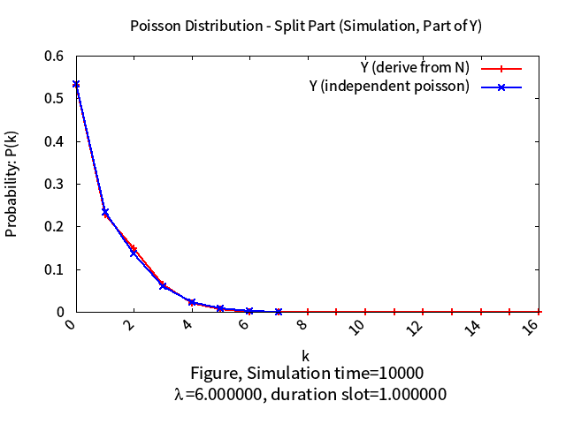 |
| 10000 | 6 | 0.5 | 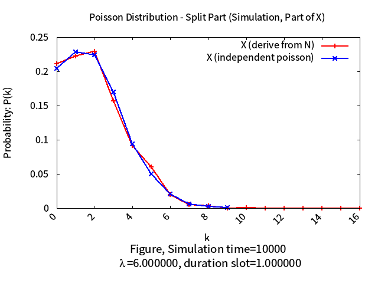 | 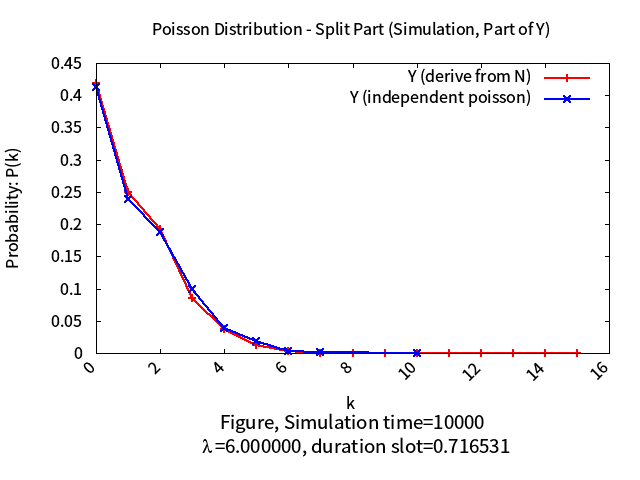 |
| 10000 | 6 | 0.7 | 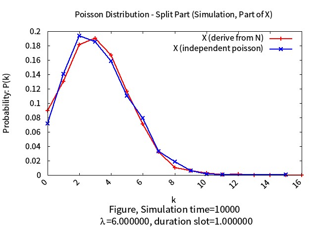 | 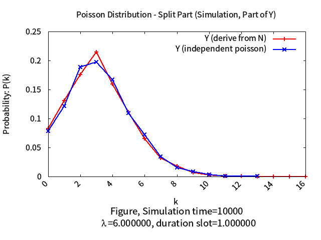 |
| 100000 | 6 | 0.3 | 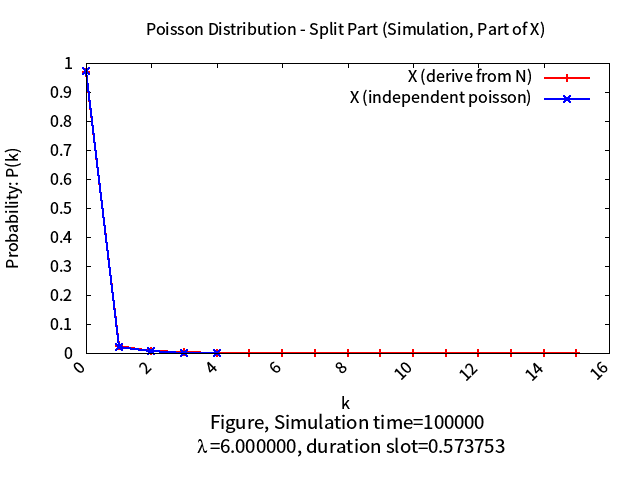 | 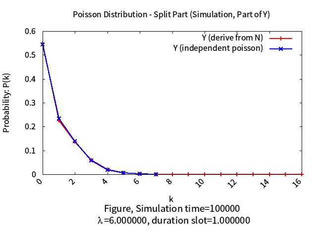 |
| 100000 | 6 | 0.5 | 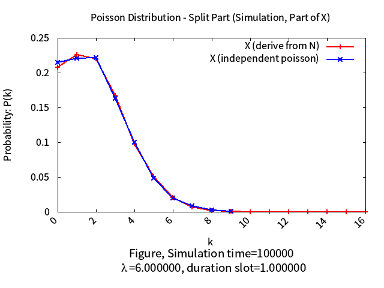 | 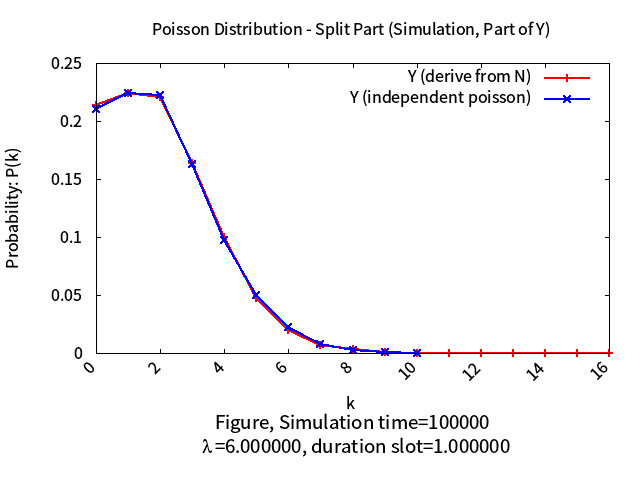 |
| 100000 | 6 | 0.7 | 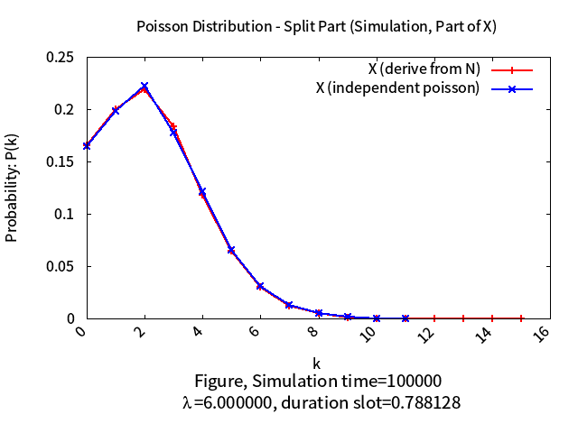 | 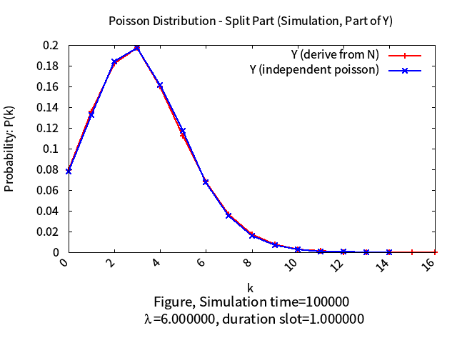 |
| 100000 | 30 | 0.3 | 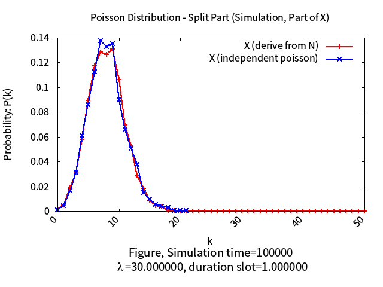 | 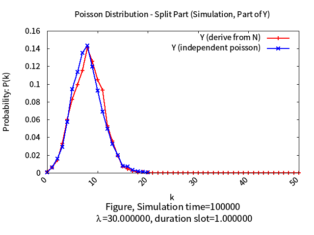 |
| 100000 | 30 | 0.5 | 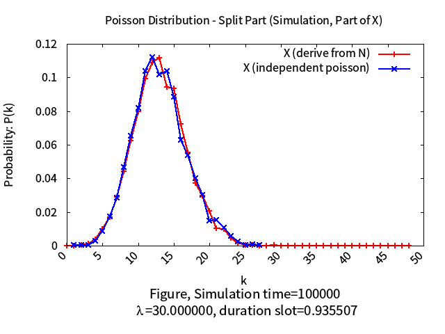 | 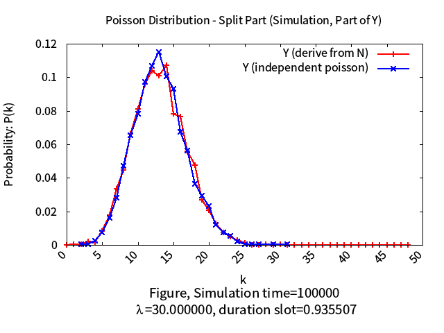 |
| 100000 | 30 | 0.7 | 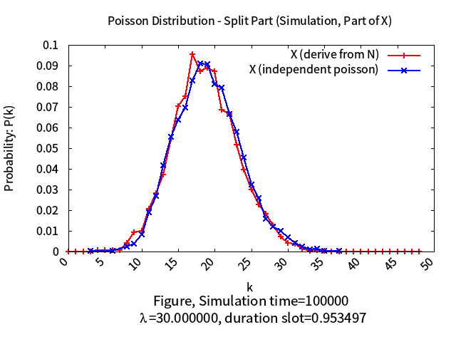 | 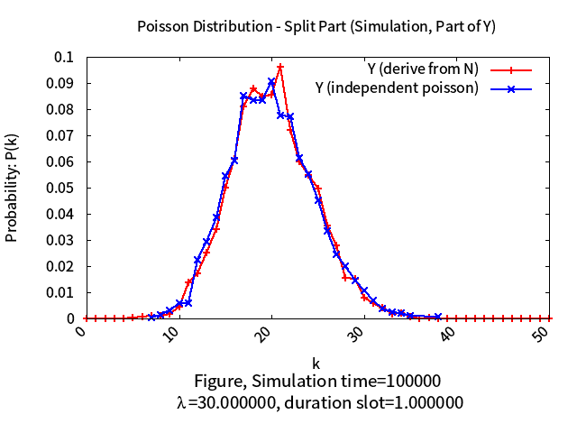 |

* Parameters:
    * `simulation times` represent the **number** of total event in simulation process.
    * `P` represent the probability of event from `N` deriving to `X`.
    * `X,LX`: result compare with `X (derive from N)` and `LX (independent Poisson)`
    * `Y,LY`: result compare with `Y (derive from N)` and `LY (independent Poisson)`

* As the result above, we can see `X, LX`, `Y, LY` are almost matching respectively !
    * And you can see case of `lambda=6`, when we increase the `simulation times` from 10000 to 100000, the result will be more matching.

--- 

## Reference

* [Basic Concept of Poisson Process](https://www.probabilitycourse.com/chapter11/11_1_2_basic_concepts_of_the_poisson_process.php)

--- 

## Author 

* Kevin Cyu, kevinbird61@gmail.com