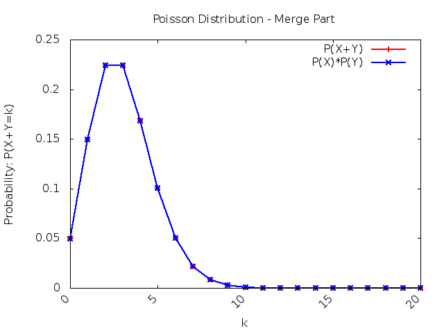
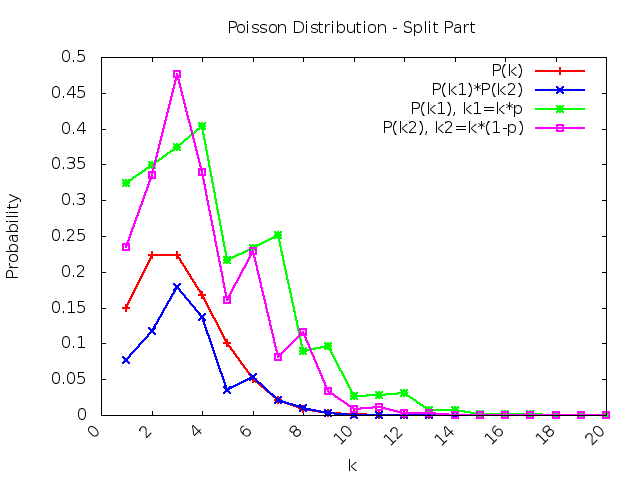

# Poisson Probability Discussion

<!-- TOC -->

- [Poisson Probability Discussion](#poisson-probability-discussion)
    - [Improvement](#improvement)
    - [Discuss two *network model*](#discuss-two-network-model)
        - [Example 2.37 (Merge)](#example-237-merge)
            - [Difference (TODO)](#difference-todo)
        - [Example 3.23 (Split)](#example-323-split)
            - [Difference (TODO)](#difference-todo)
    - [Author](#author)

<!-- /TOC -->

## Improvement 

After `example 2.5`, `3.31`, the program has been refactor a lot, make code reusable.

* Consider simulation need to be tested with several different input, to **accelerate** the arguments parsing process, I construct `parse_arg` class to deal with this problem. [See more about `parse_arg`.](../utils/README.md#parse_arg)

## Discuss two *network model*

### Example 2.37 (Merge)
* It will be implemented in `part_a.cc`

Consider the formula: $$P(X+Y=n)=\sum_{k=0}^nP(X=k, Y=n-k)   $$

$$ = \sum_{k=0}^nP(X=k) \cdot P(Y=n-k)$$

So that we can :

* **Directly** calculate the *S=X+Y* with: $$\frac{e^{-(\lambda_1+\lambda_2)}}{n!} \cdot (\lambda_1 + \lambda_2)^n$$

* **Separately** calculate *X* and *Y* with: $$P(X=k) =\frac{e^{-(\lambda_1)}}{n!} \cdot (\lambda_1)^n, P(Y=n-k) =\frac{e^{-(\lambda_2)}}{(n-k)!} \cdot (\lambda_2)^{n-k}$$, and need to consider the summation, from **k=0~n**: $$\sum_{k=0}^n ...$$

* So we need to compare these two part:
    * run with command `make run && make plot` to run the program and plot: $$k=40,\ \lambda_1=1,\ \lambda_2=2$$, also if you want to adjust, please using `./part_a.out -h` to see more.
    
    * As the `part_a.png` shown, two line match perfectly. It means that the results generate `directly` or `separately` are the same.

#### Difference (TODO)

### Example 3.23 (Split)
* It will be implemented in `part_b.cc`

* Testing with statistics: $$k=40,\ \lambda=10,\ p=0.4$$, also if you want to adjust, please using `./part_b.out -h` to see more.

#### Difference (TODO)

## Author 

* Kevin Cyu, kevinbird61@gmail.com