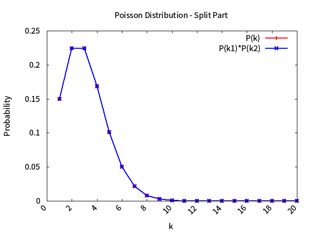
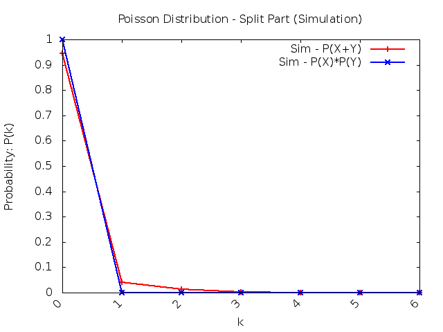

# Poisson Probability Discussion

<!-- TOC -->

- [Poisson Probability Discussion](#poisson-probability-discussion)
    - [Improvement](#improvement)
    - [Discuss two *network model*](#discuss-two-network-model)
        - [Example 2.37 (Merge)](#example-237-merge)
            - [Mathematic Model](#mathematic-model)
            - [Simulation Model](#simulation-model)
            - [Result](#result)
            - [Difference (TODO)](#difference-todo)
        - [Example 3.23 (Split)](#example-323-split)
            - [Difference (TODO)](#difference-todo-1)
    - [Reference](#reference)
    - [Author](#author)

<!-- /TOC -->

## Improvement 

After `example 2.5`, `3.31`, the program has been refactor a lot, make code reusable.

* Consider simulation need to be tested with several different input, to **accelerate** the arguments parsing process, I construct `parse_arg` class to deal with this problem. [See more about `parse_arg`.](../utils/README.md#parse_arg)

## Discuss two *network model*

### Example 2.37 (Merge)
* It will be implemented in `part_a.cc`

#### Mathematic Model

* Because N1,N2 is **independent**, so we know N1=> $$N_1 | N=n \sim Binomial(n,p)$$, which N2: $$N_2 | N=n \sim Binomial(n,1-p)$$ , Both N1,N2 is a sum of `n` independent *Bernoulli(p)* random variables, with `Binomial(N,P)`, N and P represent **Number and Probability**.

* We have: 

$\begin{array}{lcl}
P_{N_1}(k)&=& \sum_{n=0}^\infty P(N_1=k | N=n)\cdot P_{N1}(n) \\
& & \\
& = &\sum_{n=k}^\infty C_k^n \cdot p^k (1-p)^{n-k} \cdot e^{-\lambda} \frac{\lambda^n}{n!} \\
& & \\
& = &\sum_{n=k}^\infty \frac{p^k(1-p)^{n-k}\lambda^n}{k!(n-k)!}
& & \\
& = & \frac{e^{-\lambda}\cdot (\lambda p)^k}{k!} \sum_{n=k}^\infty \frac{(\lambda (1-p)^{n-k})}{(n-k)!} \\
& & \\
& = & \frac{e^{-\lambda}\cdot (\lambda p)^k}{k!}  \cdot e^{\lambda(1-p)}\\
& & \\
& = & \frac{e^{-\lambda p}\cdot (\lambda p)^k}{k!} \ , for \ k = 0,1,2, ...\\
\end{array}$

* So that we conclude that

$\begin{aligned}
& N_1 \sim Poisson(\lambda\cdot p) \\
& N_2 \sim Poisson(\lambda\cdot (1-p)) \\ 
\ \\
& which\ N_1\ and\ N_2\ are\ independent,\ \\
& so\ P_{N_1+N_2}\ will\ be\ :\\
& P_{N_1+N_2}(n,m) = P_{N_1}(n) \cdot P_{N_2}(m) \\
\end{aligned}$

* Consider the formula: $$P(X+Y=n)=\sum_{k=0}^nP(X=k, Y=n-k)   $$

$$ = \sum_{k=0}^nP(X=k) \cdot P(Y=n-k)$$

So that `Merging Poisson Process` can be:

* **Directly** calculate the *S=X+Y* with: $$P(X+Y=n)=\frac{e^{-(\lambda_1+\lambda_2)}}{n!} \cdot (\lambda_1 + \lambda_2)^n$$

* **Separately** calculate *X* and *Y* with: 

$\begin{array}{lcl}
P(X=k) &=&\frac{e^{-(\lambda_1)}}{n!} \cdot (\lambda_1)^n, \\
& & \\
P(Y=n-k) &=&\frac{e^{-(\lambda_2)}}{(n-k)!} \cdot (\lambda_2)^{n-k}
\end{array}$
, and need to consider the summation, from **k=0~n**: $$\sum_{k=0}^n ...$$

#### Simulation Model

* We can use poisson random variable to simulate a process with poisson distribution.

* And then observe the simulation result, compare with mathematic one.

#### Result

* So we need to compare these two part:
    * run with command `make run && make plot` to run the program and plot: $$k=20,\ \lambda_X=1,\ \lambda_Y=2$$, also if you want to adjust, please using `./part_a.out -h` to see more.
    
* As the `part_a.png` shown, two line match perfectly. It means that the results generate `directly` or `separately` are the same.

* And there are some difference between simulation and mathematic results.
    * Compare `Sim - P(X)*P(Y)` and `P(X)*P(Y)`, 

#### Difference (TODO)

### Example 3.23 (Split)
* It will be implemented in `part_b.cc`

* Testing with statistics: $$k=20,\ \lambda=10,\ p=0.4$$, also if you want to adjust, please using `./part_b.out -h` to see more.

* And simulation part: 

#### Difference (TODO)

## Reference

* [Basic Concept of Poisson Process](https://www.probabilitycourse.com/chapter11/11_1_2_basic_concepts_of_the_poisson_process.php)

## Author 

* Kevin Cyu, kevinbird61@gmail.com