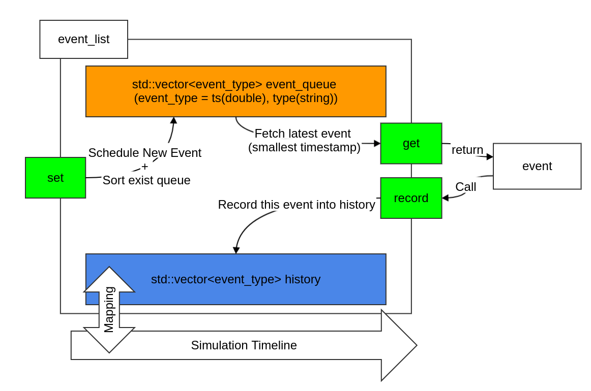

# Utility

## parse_arg

* using `getopt` to create object, more efficient to use arguments.

* example code usage:
```cpp
#include "parse_arg.h"
...

int main(int argc,char **argv){
...
// create parsing args object
parse_args *args = new parse_args();
// set rules 
args->set_args_rules("v","version","0.0.1","string");
args->set_args_rules("l","lambda","1","int");
args->set_args_rules("k","execution times","5","int");
// parse it!
args->parsing(argc,argv);
// print out 
printf("%s\n",args->get_args_val("v").val.c_str());
printf("%d\n",std::atoi(args->get_args_val("l").val.c_str()));
printf("%s\n",args->get_args_val("k").val.c_str());
...
```

* and corresponded output

```sh
$ ./a.out
0.0.1
1
5
```

## event

* Provide class `event` for discrete event utility.

* Workflow:



## rand_gen

* provide random variable generation.

## poisson 

* Generate the Poisson probability : $$p(i) = P\{X=n\} = \frac{e^{-\lambda}}{n!} \cdot \lambda^n, \ \ \  n=0,1, ...$$

* usage: 
    * $$poisson(\lambda,k)$$
    * which `k` represent as `X`'s value, **e.g.** *P{X=k}*